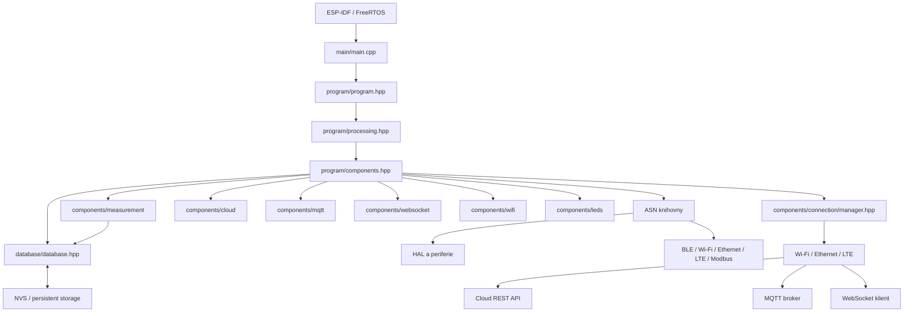
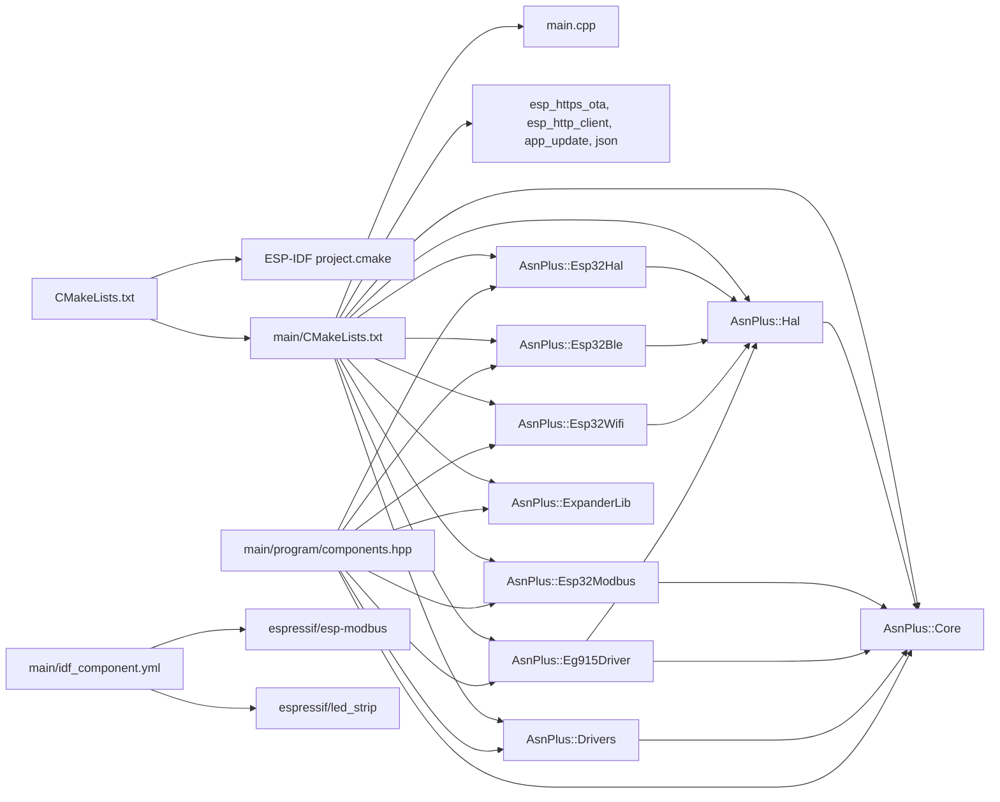
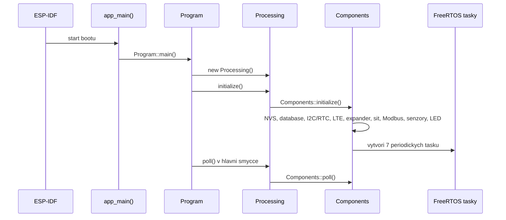
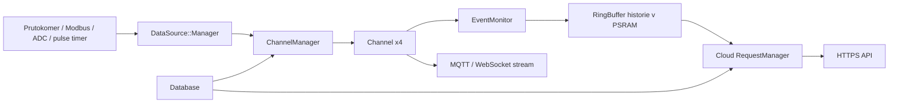
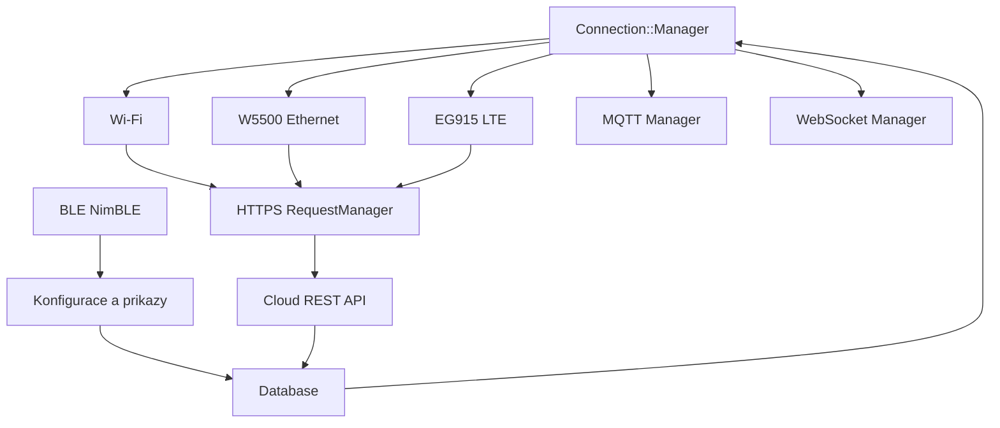

# BeerOS - mapa projektu a zavislosti

Tento dokument je orientacni mapa firmware BeerOS pro ESP32-S3. Popisuje, kde je ktera odpovednost, jak se projekt sestavuje a jak data prochazeji za behu.

> Zdroj pravdy pro chovani je vzdy aktualni kod. Tento dokument je index pro rychle hledani.

## 1. Velky obraz



## 2. Strom repozitare

```text
BeerOS/
├── CMakeLists.txt                 # vstup ESP-IDF projektu a verze firmwaru
├── partitions.csv                 # rozlozeni flash oddilu
├── sdkconfig*                     # konfigurace ESP-IDF
├── main/
│   ├── CMakeLists.txt             # registrace komponenty a ASN targety
│   ├── idf_component.yml          # IDF 5.5.2+, led_strip, esp-modbus
│   ├── main.cpp                    # app_main(); jediny C vstup firmwaru
│   ├── asn_module_config.hpp       # compile-time limity a log levely ASN
│   ├── asn/                        # lokalni ASN knihovny a jejich CMake targety
│   │   ├── asn-core/               # zakladni typy, logger, timer, utility, kontejnery
│   │   ├── asn-hal/                # obecne hardwarove abstrakce
│   │   ├── asn-esp32-hal/           # ESP32 GPIO, I2C, SPI, UART, NVS, cas
│   │   ├── asn-esp32-ble/           # NimBLE a BLE sluzby/atributy
│   │   ├── asn-esp32-wifi/          # Wi-Fi, Ethernet, HTTP(S), MQTT, SNTP
│   │   ├── asn-esp32-modbus/        # Modbus RTU master
│   │   ├── asn-eg915-driver/        # LTE EG915 a AT parser
│   │   ├── asn-expander-lib/        # externi expander, ADC, GPIO a timery
│   │   └── asn-drivers/             # konkretni ovladace, napriklad RTC
│   ├── program/
│   │   ├── program.hpp              # singleton Program; vytvori Processing a spusti smycku
│   │   ├── processing.hpp            # tenka vrstva nad Components
│   │   ├── components.hpp            # hlavni composition root, inicializace a FreeRTOS tasky
│   │   ├── config.hpp                # aplikacni konfigurace a log levely
│   │   └── pinout.hpp                # mapovani funkci na ESP32 piny
│   ├── database/
│   │   ├── database.hpp              # konfigurace, runtime stav, historie a NVS synchronizace
│   │   └── adv_data.hpp              # BLE advertising data
│   └── components/
│       ├── connection/               # volba transportu, stav site a rizeni komunikace
│       ├── cloud/                    # REST requesty, OTA a JSON konverze
│       ├── measurement/              # kanaly, senzory, eventy a historie
│       ├── mqtt/                     # MQTT manager
│       ├── websocket/                # WebSocket server a stream dat
│       ├── wifi/                     # adapter mezi legacy konfiguraci a Wi-Fi managerem
│       ├── leds/                     # WS2812 LED strip
│       └── psram_util.hpp             # pomocne funkce pro PSRAM
├── managed_components/
│   ├── espressif__esp-modbus/        # IDF Component Manager zavislost
│   └── espressif__led_strip/         # IDF Component Manager zavislost
├── docs/
│   ├── project-architecture.md       # tento dokument
│   ├── websocket-implementation-guide.md
│   └── api/rvs_sbh_api.yaml           # OpenAPI kontrakt cloud API
└── tools/                             # pomocne skripty mimo firmware
```

## 3. Build zavislosti



### Co je dulezite pri buildu

- Root `CMakeLists.txt` nacita ESP-IDF a nastavuje projekt `BeerOS_0_7_3`.
- `main/CMakeLists.txt` registruje aplikacni komponentu a zapina volitelne podslozky `main/asn/*`, pokud existuji.
- ASN knihovny se v tomto workspace sestavuji jako lokalni targety; nektere jejich implementace mohou byt dodane jako predem sestavene knihovny v `lib/`.
- `main/idf_component.yml` pridava komponenty `espressif/led_strip` a `espressif/esp-modbus`.
- `build/` je generovany vystup CMake/Ninja. Pri hledani zdroje chovani zacni v `main/`, ne v `build/`.

## 4. Start firmwaru a runtime



### Vstupni body

1. `main/main.cpp` definuje `extern "C" app_main()`.
2. `Program::main()` vytvori `Processing` a zavola `run()`.
3. `Processing` pouze deleguje na `Components`.
4. `Components` je composition root: vlastni instance hardwaru, databaze, manageru a jejich vazby.
5. Hlavni smycka sleduje heap; skutecna prace probiha hlavne ve FreeRTOS taskech.

## 5. FreeRTOS tasky a frekvence

Vsechny tasky jsou vytvareny v `main/program/components.hpp`:

| Task | Interval | Ucel |
|---|---:|---|
| `controlTask` | 10 ms | `ChannelManager::poll()`, zpracovani kanalu a eventu |
| `componentsTask` | 25 ms | expander, LED, stav nabijeni, baterie |
| `dataSourceTask` | 25 ms | cteni Modbus/pulse/ADC dat |
| `communicationTask` | 100 ms | databaze, connection manager, HTTPS a cloud requesty |
| `lteUartTask` | 100 ms | obsluha AT UARTu pro EG915 |
| `streamTask` | 200 ms | WebSocket a MQTT stream |
| `systemTask` | 1000 ms | cas a historie |
| `otaTask` | 1000 ms | fronta OTA, download obrazu a restart |

`Program::run()` navic vola `Components::poll()` v hlavni uloze. OTA docasne blokuje bezne HTTPS a stream sluzby, aby se uvolnily TLS/socket zdroje.

## 6. Tok mereni a udalosti



- `DataSource::Manager` normalizuje hodnoty ze zdroju.
- `ChannelManager` ma ctyri kanaly a podle konfigurace binduje flow, teplotu a tlak.
- `EventMonitor` zacina a ukoncuje udalosti podle toku; uzavrene udalosti se ukladaji do historie kanalu.
- Historie je v runtime v PSRAM, ne v NVS. Odeslane udalosti se oznaci jako synchronizovane; pri chybe zustavaji pro retry.
- `communicationTask` posila stav a udalosti pres aktivni transport. `streamTask` obsluhuje prubezny MQTT/WebSocket stream.

## 7. Komunikacni tok



`Connection::Manager` je misto, kde se rozhoduje, zda je sit dostupna a ktery transport se pouzije pro HTTPS. WebSocket a MQTT se spousteji pouze pri dostupne siti. BLE slouzi predevsim pro lokalni konfiguraci a stavove sluzby.

## 8. Konfigurace a persistence

| Oblast | Runtime vlastnictvi | Persistence / zdroj |
|---|---|---|
| device config | `Database::deviceConfig` | NVS `device_cfg`, cloud timestamp sync |
| network config | `Database::networkConfig` | NVS `network_cfg`, cloud a Wi-Fi slot 0 |
| MQTT config | `Database::mqttConfig` | NVS `mqtt_cfg`, cloud |
| channel config | `Database::channelConfigs[0..3]` | NVS `ch_cfg_0..3`, cloud |
| sekvence historie | `channelHistorySeqNums[0..3]` | NVS `ch_seq_0..3` |
| reset counter | `Database::resetCountTotal` | NVS `reset_count` |
| event historie | `eventHistory0..3` | PSRAM ring buffery, runtime |
| casova konfigurace | `Database::timeConfig` / `TimeManager` | casovy modul, klic `time_cfg` |

Hlavni synchronizacni hranice je `Database`: nacita konfiguraci pri startu, prubezne ji propisuje do manageru a `RequestManager` pouziva timestampy pro rozhodnuti server versus zarizeni.

## 9. Kde hledat podle problemu

| Problem nebo zmena | Zacni zde | Navazujici mista |
|---|---|---|
| firmware nenastartuje | `main/main.cpp`, `main/program/program.hpp` | `main/program/components.hpp` |
| inicializace hardware | `main/program/components.hpp` | `main/program/pinout.hpp`, konkretni `main/asn/*` |
| piny, UART, I2C, SPI | `main/program/pinout.hpp` | konstrukce objektu v `components.hpp` |
| konfigurace se neuklada | `main/database/database.hpp` | NVS helper v `asn-esp32-hal` |
| senzor nebo pocitadlo prutoku | `main/components/measurement/` | `main/program/components.hpp`, Modbus/expander ASN |
| stav a historie ctyr kanalu | `main/components/measurement/channel_manager.hpp` | `channel.hpp`, `event_monitor.hpp`, `database.hpp` |
| Wi-Fi a dostupnost site | `main/components/connection/manager.hpp` | `main/components/wifi/manager_adapter.hpp` |
| REST/cloud requesty | `main/components/cloud/request_manager.hpp` | `connection/manager.hpp`, `docs/api/rvs_sbh_api.yaml` |
| MQTT | `main/components/mqtt/` | `connection/manager.hpp`, `Database::mqttConfig` |
| WebSocket stream | `main/components/websocket/` | `docs/websocket-implementation-guide.md` |
| OTA update | `main/program/components.hpp` | `main/components/cloud/request_manager.hpp`, ESP-IDF OTA |
| BLE konfigurace | `main/asn/asn-esp32-ble/` | `database.hpp`, `connection/manager.hpp` |
| build nebo zavislost | `CMakeLists.txt`, `main/CMakeLists.txt` | `main/idf_component.yml`, `sdkconfig*` |

## 10. Rychle prikazy pro orientaci

```powershell
# zdrojove soubory aplikace
Get-ChildItem .\main -Recurse -File

# hledani inicializace a periodickych smycek
rg "initialize\(|poll\(|xTaskCreate|app_main" .\main

# hledani konfiguracnich klicu a persistence
rg "NVS_KEY|load_config|save[A-Z]|PersistentStorage" .\main

# hledani konkretniho manageru nebo toku
rg "RequestManager|Connection::Manager|ChannelManager|Mqtt::Manager|Websocket::Manager" .\main
```

## 11. Poznamky k hranicim kodu

- Aplikacni logika je v `main/`; `build/` neupravovat rucne.
- `main/program/components.hpp` je zamerne centralni skladba objektu. Pri pridani noveho manageru je treba resit jeho poradi konstrukce, inicializaci a prirazeni do tasku.
- ASN vrstva poskytuje opakovane pouzitelne periferie a protokoly. Pri oprave chovani nejprve zjisti, zda je kod v headeru workspace, nebo v predem sestavene knihovne `lib/`.
- OpenAPI soubor popisuje cloudovy kontrakt, ale neni automaticky kompilovan do firmware.
